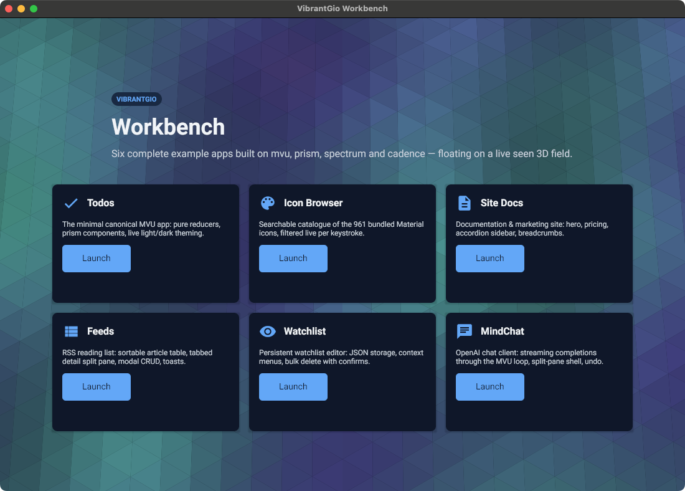
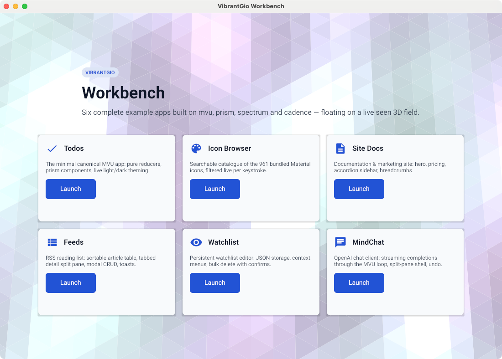
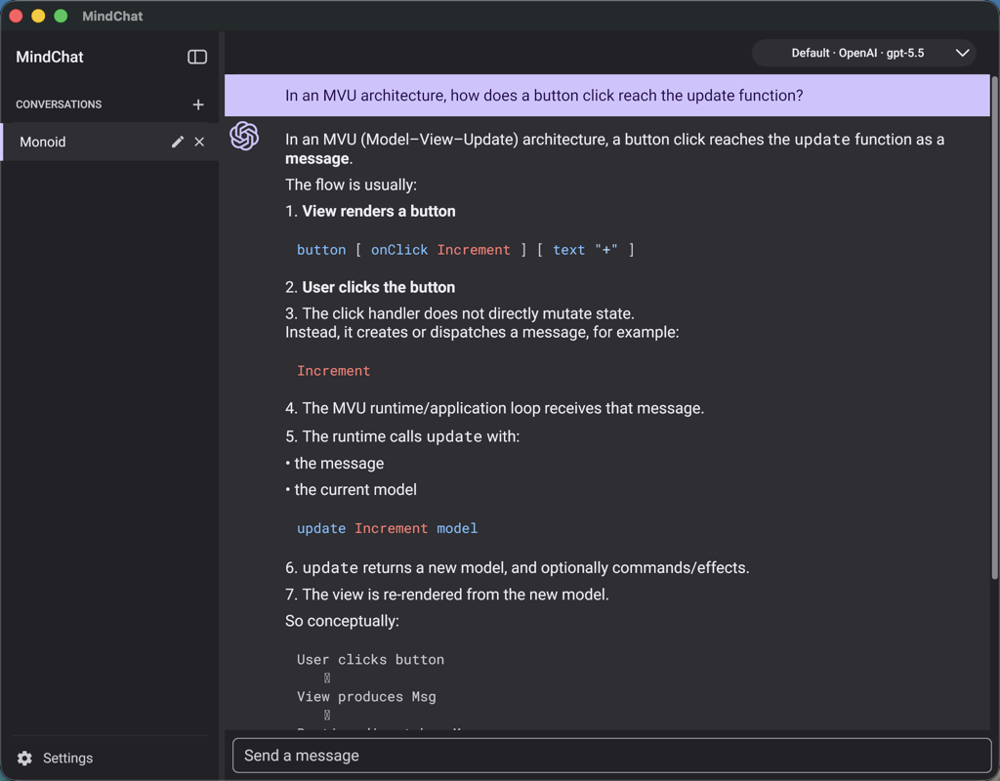
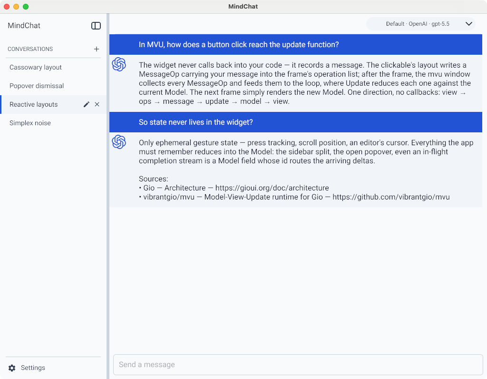

# VibrantGio

VibrantGio is a design system for native desktop applications on macOS, Windows
and Linux, written in pure Go on [Gio](https://gioui.org). An application is a
Model-View-Update loop over [reactivego/rx](https://github.com/reactivego/rx)
observables — state, theme and rendering are all driven reactively — and the
design decisions follow Material Design's *generative* ideas, design tokens and
semantic roles rather than a transcription of the Android widget set.

## Start here

- **[llms.txt](https://raw.githubusercontent.com/vibrantgio/.github/master/llms.txt)** —
  the canonical guide for writing VibrantGio applications, and the file to hand
  a coding assistant. Module inventory with current tags, the application
  skeleton, MVU and rx semantics, typography, and the pitfalls that are not
  guessable. It exists exactly once, in
  [`.github`](https://github.com/vibrantgio/.github); every repository links
  this URL instead of copying it.
- **[workbench/DESIGN.md](https://github.com/vibrantgio/workbench/blob/master/DESIGN.md)** —
  the architecture and its rationale: FRP and MVU application structure, frame
  synchronisation, subscription lifecycle, threading rules, accessibility,
  performance, and the known fragilities.
- **[workbench/todos/](https://github.com/vibrantgio/workbench/tree/master/todos)** —
  the smallest complete application, and the one to read before writing your
  own. Six larger references sit beside it in
  [workbench](https://github.com/vibrantgio/workbench): `sitedocs`, `feeds`,
  `watchlist`, `mindchat`, `iconbrowser` and `launcher`.

  
  

  
  

The [workbench](https://github.com/vibrantgio/workbench) launcher and MindChat,
each captured in the OS dark and light appearance — spectrum re-themes every
window live when the system switches.

## The stack

Nineteen modules, one per repository, layered. A module may import only modules
in a strictly lower tier, plus anything in the support row; the support
libraries import nothing else from the organization. Rows marked † are
mid-migration.

| Tier | Module | What it is |
| --- | --- | --- |
| 0 | [mvu](https://github.com/vibrantgio/mvu) | Model-View-Update runtime for Gio: `NewWindow`, the update/view loop, messages, commands, and the `MessageOp` widget protocol |
| 0 | [font](https://github.com/vibrantgio/font) | Roboto packaged as Gio faces — six weights, Thin to Black, regular and italic |
| 0 † | [style](https://github.com/vibrantgio/style) | Type scale (H1–H6, Subtitle, Body, Button, Caption, Overline) and `FontFaces()`, the app's shaper collection today |
| 0 | [textdraw](https://github.com/vibrantgio/textdraw) | Low-level text drawing: glyph-level control, measurement, alignment, label backgrounds |
| 0 | [backdrop](https://github.com/vibrantgio/backdrop) | Solid colour fill widget |
| 0 | [gradient](https://github.com/vibrantgio/gradient) | Linear gradient fill widget |
| 0 | [circle](https://github.com/vibrantgio/circle) | Mathematically precise circles via Bézier approximation |
| 1 † | [spectrum](https://github.com/vibrantgio/spectrum) | Reactive theme runtime: live OS dark-mode and accent tracking, preference persistence, window integration, animated theme transitions |
| 2 † | [prism](https://github.com/vibrantgio/prism) | Component foundation: button, input, list, richtext, scrollbar, icon, layout, a11y, keyed identity, coordination, cache — and, for now, the `tokens` and `theme` contract |
| 3 | [pulse](https://github.com/vibrantgio/pulse) | Effects layer: tween, spring, springbutton, glow, depth, motion, and a shared animation conductor |
| 4 | [cadence](https://github.com/vibrantgio/cadence) | Pattern library: shell, navbar, sidebar, table, pagination, tabs, modal, alert, popover, tooltip, toast, card, accordion, breadcrumb, hero, feature, pricing, testimonial |
| 4 | [markdown](https://github.com/vibrantgio/markdown) | GFM document rendering on prism widgets, with chroma syntax highlighting and SVG images |
| — | [ivg](https://github.com/vibrantgio/ivg) | IconVG: compact binary format for vector icons, with a converter for the Material Design icon set |
| — | [svg](https://github.com/vibrantgio/svg) | SVG parsing and rendering, with Gio, raster, PDF and seen drivers |
| — | [seen](https://github.com/vibrantgio/seen) | 3D scene graph rendered to SVG or Gio |
| — | [csg](https://github.com/vibrantgio/csg) | Constructive solid geometry on meshes using BSP trees |
| — | [kiwi](https://github.com/vibrantgio/kiwi) | Cassowary constraint solver, with a Gio layout binding |
| — | [noise](https://github.com/vibrantgio/noise) | Perlin and Simplex noise, 2D and 3D |
| — | [traer](https://github.com/vibrantgio/traer) | Particle-system physics: springs, attractions, Verlet integration |

† **Mid-migration.** The token and theme contract still lives in `prism/tokens`
and `prism/theme`, so `spectrum` — the theme runtime — imports the component
library it exists to theme, and reaches up to `pulse/tween` for its transitions.
Moving that contract down into `spectrum`, and `spectrum/transition` up into
`pulse`, is in progress; until it lands, tiers 1 and 2 hold edges the rule above
forbids. Components also still compile in `gioui.org/font/gofont` rather than
taking their faces from `style` and `font`. `style` carries the one intra-tier
edge — it imports `font` and `textdraw`, both tier 0 — and is frozen at its
current scale rather than deleted.

Ten further modules live in subdirectories of the repositories above:
`prism/gallery`, `mvu/example`, `ivg/raster/gio`, `kiwi/gio`, `traer/gio`,
`seen/context/gio` and `svg/driver/{gio,pdf,raster,seen}`. They do not show up
in a repository listing, and their tags carry the subdirectory as a prefix
(`raster/gio/v0.1.6`, not `v0.1.6`) —
[llms.txt](https://raw.githubusercontent.com/vibrantgio/.github/master/llms.txt)
lists them all with current versions.

Two repositories hold no module in the table:
[workbench](https://github.com/vibrantgio/workbench), the design documentation
and the seven example applications, and
[.github](https://github.com/vibrantgio/.github), which holds this page and the
canonical guide. Every module in the organization builds on gioui.org v0.10.1,
github.com/reactivego/rx v0.3.0 and Go 1.25.1.
